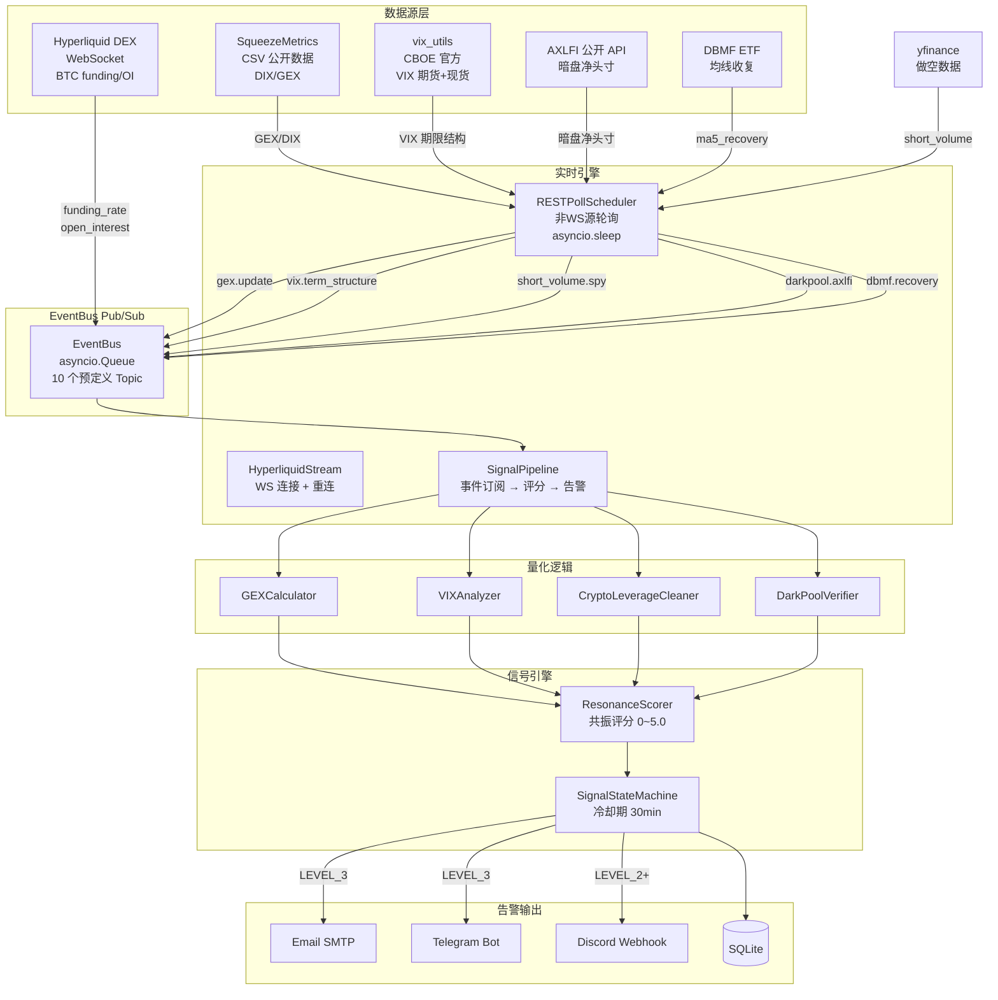

# 多源共振暗盘与流动性微观结构监控系统

## 项目概述

基于 **WebSocket + EventBus 实时事件驱动（Push）架构** 的多源数据共振金融监控系统。配备 **React 前端仪表盘** 和 **FastAPI REST 后端**，实时追踪美股暗盘机构资金动向、做市商 Gamma 敞口、VIX 波动率期限结构和加密市场杠杆清洗。通过四维度共振评分自动识别"流动性清算衰竭"级别的抄底信号，多渠道推送告警。

### 核心能力

- **前端 Web UI**：React + TypeScript 仪表盘，系统状态监控、手动数据采集、自动轮询控制
- **实时数据流**：Hyperliquid DEX WebSocket 长连接推送 BTC 资金费率/持仓量
- **四维共振评分**：GEX + VIX + 加密杠杆 + 暗盘吸筹，满分 5.0，LEVEL_3 阈值 3.5
- **多渠道告警**：邮件（SMTP）、Telegram Bot、Discord Webhook 并发推送
- **降级容错**：Hyperliquid → CCData REST 降级、yfinance → FINRA 降级
- **异常检测**：Hawkes Process 自激抛售分支比测算、资金费率异常检测

---

## 系统架构



---

## 目录结构

```
Multi-source Resonance/
├── config/                       # 配置管理
│   ├── settings.py               # Config / StreamConfig / DataFetchConfig
│   └── .env.example              # 环境变量模板
├── data_fetchers/                # 数据获取器 (14个)
│   ├── yahoo_finance_fetcher.py  # vix_utils VIX期货+现货(CBOE官方) + yfinance做空数据
│   ├── hyperliquid_fetcher.py    # Hyperliquid DEX REST (降级备选)
│   ├── ccdata_fetcher.py         # CCData CEX REST (降级备选)
│   ├── squeezemetrics_fetcher.py # SqueezeMetrics DIX/GEX CSV
│   ├── finra_fetcher.py          # FINRA 管道文件短卖比 (降级备选)
│   ├── axlfi_fetcher.py          # AXLFI 暗盘净头寸
│   ├── dbmf_fetcher.py           # DBMF ETF 动量监控
│   ├── tradier_fetcher.py        # Tradier 期权链 (保留, 未使用)
│   ├── chartexchange_fetcher.py  # ChartExchange 场外数据 (保留)
│   ├── stockgrid_fetcher.py      # Stockgrid Playwright 爬虫 (已弃用)
│   └── ccxt_fetcher.py           # CCXT 交易所 (已弃用)
├── api_server.py                 # ★ FastAPI REST API 服务
├── frontend/                     # React + TypeScript 前端
│   ├── src/pages/                # Dashboard / SystemStatus / SignalsPanel
│   └── src/api/                  # React Query hooks
├── data_stream/                  # Push 实时流架构
│   ├── event_bus.py              # 异步事件总线 (Pub/Sub)
│   ├── hyperliquid_stream.py     # Hyperliquid DEX WebSocket 连接器
│   ├── signal_pipeline.py        # 事件驱动信号管线 (679行, 核心)
│   ├── rest_poll_scheduler.py    # 非WS源轻量轮询调度器
│   ├── stream_engine.py          # 统一流引擎 (替代 MainScheduler)
│   └── __init__.py
├── quant_logic/                  # 量化计算逻辑
│   ├── gex_calculator.py         # Gamma Exposure 计算
│   ├── vix_analyzer.py           # VIX 期限结构分析
│   ├── crypto_leverage_cleaner.py # 加密杠杆清洗判定
│   └── darkpool_verifier.py      # 暗盘三驾马车验证
├── signal_engine/                # 信号引擎
│   ├── resonance_scorer.py       # 多维度共振评分 (0~5.0)
│   └── signal_trigger.py         # 信号状态机 + 冷却期管理
├── notification/                 # 告警推送
│   └── alert_sender.py           # Email/Telegram/Discord 多渠道
├── database/                     # 数据持久化
│   ├── db_manager.py             # SQLite 管理器
│   └── schema.sql                # 4 表 + 4 视图
├── utils/                        # 工具模块
│   ├── logger.py                 # 分级日志
│   ├── exceptions.py             # 自定义异常层次
│   └── fallback_manager.py       # 降级管理器
├── main_stream.py                # ★ 系统入口 (Push 架构)
├── main_scheduler.py             # [DEPRECATED] 旧 Pull 架构入口
├── requirements.txt              # 依赖清单
└── logs/                         # 日志输出目录
```

---

## 数据源矩阵

| 维度 | 子指标 | 主要数据源 | 降级数据源 | 获取方式 | 频率 |
|------|--------|-----------|-----------|---------|------|
| **GEX/DIX** | GEX 总敞口、DIX 暗盘强度 | SqueezeMetrics CSV | — | REST 轮询 | 盘中 15min |
| **VIX** | 期限结构 (VX1/VX2), 恐慌溢价 | vix_utils (CBOE官方) | — | REST 轮询 | 盘中 15min |
| **Crypto** | BTC 资金费率、持仓量 | **Hyperliquid DEX WebSocket** | CCData REST API | **WebSocket 实时推送** | 实时 |
| **Darkpool** | 暗盘净头寸、底背离 | AXLFI API | — | REST 轮询 | 盘中 15min |
| **做空数据** | shortPercentOfFloat、shortRatio、sharesShort | **yfinance 库** (免费) | FINRA 管道文件 | 盘后一次性 | 1次/日 |
| **DBMF** | MA5 均线收复 | Yahoo Finance (yfinance) | — | REST 轮询 | 盘中 15min |

---

## 核心模块详解

### 1. 数据流层 (`data_stream/`)

#### EventBus — 异步事件总线

基于 `asyncio.Queue` 的发布/订阅模式，是 Push 架构的中枢：

```python
from data_stream.event_bus import EventBus, Topics

bus = EventBus()
await bus.start()

# 订阅
await bus.subscribe(Topics.CRYPTO_FUNDING_RATE, on_funding_update)

# 发布
await bus.publish(Topics.CRYPTO_FUNDING_RATE, {"rate": -0.000125, "coin": "BTC"})
```

预定义 10 个 Topic 常量：
`crypto.funding_rate` | `crypto.open_interest` | `gex.update` | `vix.term_structure` | `darkpool.axlfi` | `short_volume.spy` | `dbmf.recovery` | `data.source_error` | `data.source_recovered` | `system.shutdown`

#### HyperliquidStream — WebSocket 实时连接器

- 端点：`wss://api.hyperliquid.xyz/ws`
- 订阅：`{"method": "subscribe", "subscription": {"type": "activeAssetData", "coin": "BTC"}}`
- 推送字段：`funding`（资金费率）、`openInterest`（持仓量）、`markPx`（标记价格）、`premium`（溢价）
- 自动重连：指数退避 1s → 2s → 4s → ... → 60s 上限
- Ping/Pong 保活：每 30s，超时 10s 断开触发重连

#### SignalPipeline — 事件驱动信号管线

核心引擎（679行）。订阅 EventBus 全部业务 Topic，数据到达即时触发维度评估，四维就绪后执行共振评分：

```
Hyperliquid WS → crypto.funding_rate ─┐
Hyperliquid WS → crypto.open_interest ┤→ Crypto 维度就绪 ─┐
RESTPoll → gex.update ────────────────→ GEX 维度就绪 ────┤
RESTPoll → vix.term_structure ────────→ VIX 维度就绪 ────┤→ 共振评分 → 告警
RESTPoll → darkpool.axlfi ────────────┐                     │
RESTPoll → short_volume.spy ──────────┤→ Darkpool 维度就绪 ┘
RESTPoll → dbmf.recovery ─────────────┘
```

**防抖机制**：共振评分最小间隔 30 秒，防止高频冲刷。

#### RESTPollScheduler — 轻量轮询

替代 APScheduler 的 `asyncio.create_task` + `asyncio.sleep` 模式：
- `_poll_gex_dix()` — SqueezeMetrics GEX/DIX，盘中 15min
- `_poll_vix()` — vix_utils/CBOE VIX 期限结构，盘中 15min
- `_poll_short_volume()` — yfinance 做空数据，盘后一次性
- `_poll_axlfi()` — AXLFI 暗盘净头寸，盘中 15min
- `_poll_dbmf()` — DBMF 均线收复，盘中 15min
- `run_afterhours_short_volume()` — yfinance 做空数据，盘后一次性

### 2. 量化逻辑层 (`quant_logic/`)

| 类 | 功能 | 输出 |
|----|------|------|
| `GEXCalculator` | Gamma Exposure 计算、α 校准 | GEX 敞口值 |
| `VIXAnalyzer` | 期限结构分析、Contango/Backwardation 判定 | 结构比率、恐慌溢价 |
| `CryptoLeverageCleaner` | OI 暴跌检测、资金费率异常、ELR 安全判定 | 去杠杆完成标志 |
| `DarkPoolVerifier` | 暗盘底背离信号验证、黄金交叉检测 | 净流入确认 |

### 3. 信号引擎 (`signal_engine/`)

#### ResonanceScorer — 共振评分矩阵

| 维度 | 满分 | 关键条件 |
|------|------|---------|
| **GEX** | 1.5 分 | GEX 由负翻正 (POSITIVE) |
| **VIX** | 1.0 分 | 回归 Contango 且斜率向下 |
| **Crypto** | 1.0 分 | OI 暴跌 + 费率转正 + 去杠杆完成 |
| **Darkpool** | 1.5 分 | 三选二聚合 + DBMF 收复 |
| **总分** | **5.0 分** | |

预警级别：
- **LEVEL_3**（≥3.5）：全维度共振，最高级别告警，多渠道（Email + Telegram + Discord）
- **LEVEL_2**（≥3.0）：密切监控，Email + Discord
- **LEVEL_1**（≥2.0）：初步关注，仅 Email
- **NO_SIGNAL**（<2.0）：无信号

#### SignalStateMachine — 告警状态机

```
IDLE → MONITORING → ALERT_TRIGGERED → COOLDOWN → IDLE
```

- 冷却期：30 分钟，同一级别信号不重复触发
- 状态持久化：`./data/signal_state.json`
- 支持手动重置

### 4. 告警推送 (`notification/alert_sender.py`)

| 渠道 | 方式 | 配置项 |
|------|------|--------|
| Email | SMTP (TLS) | `EMAIL_SENDER`, `EMAIL_PASSWORD`, `EMAIL_RECIPIENTS` |
| Telegram | Bot API | `TELEGRAM_BOT_TOKEN`, `TELEGRAM_CHAT_ID` |
| Discord | Webhook | `DISCORD_WEBHOOK_URL` |

```python
from notification.alert_sender import create_alert_sender

sender = create_alert_sender()
sender.send_multi_channel_alert(
    subject="[LEVEL_3] 共振抄底信号触发",
    message=alert_message,
    channels=['email', 'telegram', 'discord']
)
```

### 5. 数据库 (`database/`)

SQLite (WAL 模式)，4 张核心表：

| 表名 | 用途 |
|------|------|
| `gex_history` | GEX 历史估算与校准值 |
| `dark_pool_metrics` | DIX、做空比、Stockgrid 斜率、DBMF 收复 |
| `crypto_derivatives` | 资金费率、OI、清算标志、杠杆率 |
| `signal_alerts` | 共振信号触发日志（含得分明细、Hawkes 分支比） |

---

## 降级链路

```
Hyperliquid DEX WebSocket (首选, 免费)
    ↓ 连接断开
CCData REST API (Free Tier, 10万次/月)

yfinance short interest (首选, 免费, 无需API Key)
    ↓ 获取失败
FINRA 管道文件 (CNMSshvol{date}.txt)
```

---

## 快速开始

### 1. 环境要求

- Python ≥ 3.10
- Windows / Linux / macOS

### 2. 安装依赖

```bash
pip install -r requirements.txt
```

### 3. 配置环境变量

```bash
# 复制模板
cp config/.env.example config/.env

# 编辑 .env 文件
```

**最低配置要求**（其他数据源为免费公开接口）：
```env
# 告警通知（至少配置一种）
EMAIL_SENDER=your_email@gmail.com
EMAIL_PASSWORD=your_app_password
EMAIL_RECIPIENTS=recipient1@example.com

# 可选：CCData API Key（加密数据降级备选，Hyperliquid 免费首选）
CCDATA_API_KEY=your_ccdata_api_key_here
```

**无需配置即可用的免费数据源**：
- Hyperliquid DEX（去中心化衍生品，完全免费）
- yfinance 做空数据（Yahoo Finance，免费，无需 API Key）
- SqueezeMetrics CSV（公开数据）
- vix_utils / CBOE 官方 VIX 数据（免费）
- AXLFI 暗盘（公开 API）
- FINRA 管道文件（官方公开数据）
- DBMF ETF（通过 yfinance）

### 4. 启动系统

```bash
# ★ Push 架构入口（推荐）
python main_stream.py
```

```python
# 或代码中启动
from main_stream import start
start()

# 或直接使用 StreamEngine
from data_stream.stream_engine import StreamEngine
engine = StreamEngine()
engine.start()
```

### 5. 验证安装

```bash
python verify_setup.py
```

---

## 技术栈

| 类别 | 技术 |
|------|------|
| **实时通信** | `websockets` (Hyperliquid DEX WebSocket) |
| **异步框架** | `asyncio` (EventBus / StreamEngine) |
| **数据处理** | `pandas`, `numpy`, `scipy` |
| **金融数据** | `vix_utils` (CBOE VIX期货+现货), `yfinance` (做空数据) |
| **Web 框架** | `FastAPI`, `uvicorn` (REST API), `React` + `TypeScript` (前端) |
| **HTTP 客户端** | `requests`, `playwright` |
| **重试机制** | `tenacity` |
| **数据验证** | `pydantic` |
| **任务调度** | APScheduler（已废弃，保留兼容） |
| **配置管理** | `python-dotenv` |
| **时区处理** | `pytz` (EST 美东时间) |
| **数据库** | SQLite (WAL 模式) |

---

## 架构演进历程

| 版本 | 架构 | 状态 |
|------|------|------|
| v1 (Phase 1-7) | APScheduler Pull 定时轮询（`main_scheduler.py`） | **[DEPRECATED]** 保留兼容 |
| v2 (Current) | WebSocket + EventBus Push 实时流（`main_stream.py`） | **Active** |

### v1 → v2 核心变化

- **数据获取**：定时 cron job → WebSocket 长连接 + EventBus 推送
- **调度器**：APScheduler → `asyncio.create_task` + `asyncio.sleep`
- **信号评估**：每 15 分钟批处理 → 数据到达即时触发
- **数据源**：FMP 短卖 JSON → yfinance 做空数据（免费）
- **加密数据**：CCXT/Coinglass → Hyperliquid DEX WebSocket（免费）
- **暗盘数据**：ChartExchange/Stockgrid → AXLFI（免费公开 API）

---

## 监控标的

默认监控列表（可扩展）：
`SPY` `QQQ` `IWM` `AAPL` `MSFT` `NVDA` `TSLA` `AMD`

---

## 许可证

本项目仅供学习和研究使用。

---
**当前版本**: v2.1 (Push 实时流 + FastAPI + React 前端)  
**最后更新**: 2026-06-09  
**入口文件**: `main_stream.py` / `api_server.py` / `frontend/`
